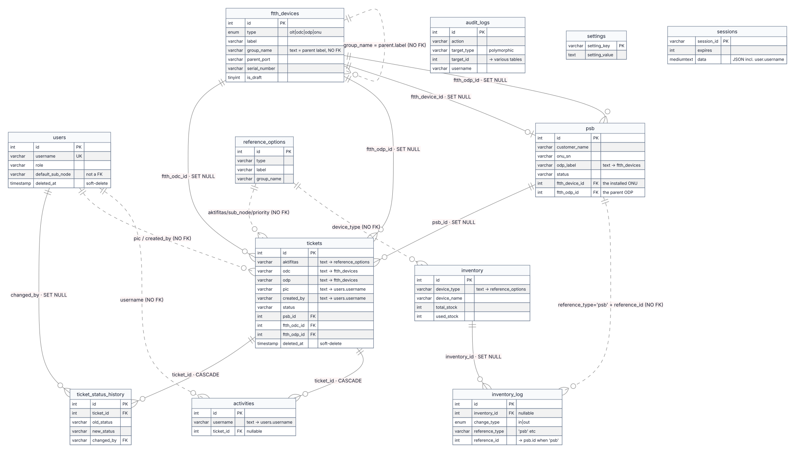
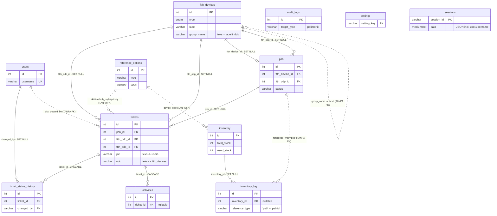

# MAYUNG — Sistem Ticketing & Manajemen Jaringan FTTH

Aplikasi web internal untuk sebuah ISP di Lombok, NTB. Menangani pelaporan gangguan & pekerjaan lapangan (ticketing), pencatatan aktivitas teknisi, topologi jaringan FTTH (OLT → ODC → ODP → ONU) beserta pelacakan port, PSB (Pemasangan Baru pelanggan), inventaris perangkat, dan peta interaktif.

**Stack:** Node.js / **Express 5** + **MySQL 8** · frontend **JavaScript vanilla** (tanpa framework, tanpa bundler) · **PWA** · notifikasi WhatsApp via Fonnte.

Semua teks campur Indonesia/Inggris. Skema database memakai nama kolom Indonesia (`aktifitas`, `lokasi`, `sub_node`, `date_selesai`). Status tiket: `Terlapor → Dikerjakan → Selesai`, plus `Pending`. Status PSB: `Terdaftar → Terpasang → Aktif`, atau `Batal`.

---

## Daftar isi

- [Fitur](#fitur)
- [Struktur proyek](#struktur-proyek)
- [Quick start](#quick-start)
- [RBAC — tiga peran](#rbac--tiga-peran)
- [Halaman frontend](#halaman-frontend)
- [API endpoints](#api-endpoints)
- [Database](#database)
- [Environment variables](#environment-variables)
- [Perintah](#perintah)
- [Keamanan](#keamanan)
- [Catatan pengembangan](#catatan-pengembangan)
- [Dokumen terkait](#dokumen-terkait)

---

## Fitur

| Modul | Ringkasan |
|---|---|
| **Ticketing** | CRUD tiket, state machine status (`VALID_TRANSITIONS` — tidak boleh lompat), soft-delete, riwayat perubahan status, upload foto bukti (wajib saat masuk `Selesai`), pembatasan field per-role, auto-assign PIC (beban paling ringan, prioritaskan yang wilayahnya cocok) |
| **Activity log** | Catatan kerja teknisi, opsional ditautkan ke satu tiket. Teknisi yang mencatat aktivitas ke tiket `Terlapor`/`Pending` miliknya otomatis memajukan status ke `Dikerjakan` |
| **FTTH** | Hierarki OLT→ODC→ODP→ONU (berbasis label, tanpa FK), pelacakan port (`Port 3` dst; Port 1 di-reserve sebagai uplink), CRUD di `ftth.html`. Entri ONU juga dibuat otomatis sebagai *draft* dari transisi PSB → `Terpasang`, menunggu konfirmasi staf |
| **PSB** | Form registrasi pelanggan + ONU, upload foto, alur `Terdaftar → Terpasang → Aktif` / `Batal`. Transisi ke `Terpasang` mengurangi stok ONU terpilih di inventory dan membuat draft entri FTTH — dalam satu transaksi |
| **Inventory** | Stok perangkat + histori pemakaian; log yang dipicu PSB menyimpan `reference_type='psb'` + `reference_id` untuk telusur balik |
| **Peta** | Leaflet, dibatasi bounds NTB, marker per tipe perangkat, terbang ke titik dari link `ftth.html` |
| **Dashboard & SLA** | Statistik agregat bulanan, aging tiket terbuka, target SLA per prioritas + kepatuhan, tiket `breached`/`atRisk`, kinerja per Teknisi (khusus Owner/Operator), Chart.js |
| **Export** | CSV (dengan BOM Excel) & PDF dari daftar tiket — blok ringkasan (by status, by priority, aktifitas & wilayah terbanyak, tren kendala per bulan, rentang tanggal data) mendahului baris data mentah |
| **Notifikasi WhatsApp** | Otomatis (fire-and-forget) saat tiket dibuat & saat status berubah → pembuat tiket + PIC (Operator sengaja tidak diikutkan). Pesan menyertakan link `<APP_URL>/ticket-details.html?id=` |
| **RBAC** | 3 role: **Owner** (penuh, satu-satunya yang bisa hapus), **Operator** (kelola, tak bisa hapus), **Teknisi** (hanya milik sendiri) |
| **PWA** | Service worker (network-first untuk halaman & JS, stale-while-revalidate untuk aset) + manifest — installable di HP, jalan offline terbatas |
| **Kesiapan operasional** | `GET /health` (cek koneksi DB sungguhan), graceful shutdown, audit trail `audit_logs`, detail request log ke file, test suite + CI (GitHub Actions) |

---

## Struktur proyek

```
.
├── server.js                 Entry point Express 5 — rantai middleware, GET /health, graceful shutdown
├── db.js                     Pool mysql2/promise (connectionLimit 10, queueLimit 30)
├── schema.sql                Source of truth database untuk instalasi baru (sudah mencakup semua migrasi)
├── .env.example              Template environment
├── .eslintrc.json / .prettierrc
├── .github/workflows/ci.yml  CI: eslint + mocha di MySQL 8 container yang di-provision dari nol
│
├── middleware/               (7 file)
│   ├── auth.js               isAuthenticated · isAdmin (Owner) · isOwnerOrOperator
│   ├── asyncHandler.js       Bungkus handler async → auto-catch, log, 500
│   ├── csrf.js               Double-submit cookie CSRF (timing-safe, rotasi token)
│   ├── rateLimits.js         mutationLimiter(label, max) — dipasang per-route
│   ├── upload.js             Multer: gambar saja, 5 MB, verifikasi magic bytes
│   ├── detailLog.js          Log tiap request ke logs/detail-*.log (field sensitif di-redact)
│   └── audit.js              audit(...) → tabel audit_logs
│
├── routes/                   (11 file, semua di-mount di '/' tanpa prefix)
│   ├── auth.js               POST /login · /logout · /register (Owner-only)
│   ├── users.js              /users · /update-profile · /update-role · /admin/users/update · DELETE + restore
│   ├── tickets.js            /tickets CRUD + /tickets/:id/update + /tickets/:id/history + GET /api/auto-pic
│   ├── activities.js         /activities CRUD (auto-start tiket dari log aktivitas)
│   ├── psb.js                /api/psb CRUD (transisi Terpasang → decrement inventory + draft ONU)
│   ├── ftth.js               /api/ftth CRUD + /api/ftth/available-ports (sumber kebenaran topologi)
│   ├── geo.js                GET /api/geo (data peta)
│   ├── inventory.js          /api/inventory CRUD + /api/inventory/log
│   ├── references.js         /api/references CRUD (dropdown non-FTTH + salinan legacy FTTH)
│   ├── settings.js           /settings/company-name · /company-logo
│   └── stats.js              GET /api/stats/month (agregat dashboard + SLA/KPI)
│
├── services/notification.js  WhatsApp via Fonnte API
├── utils/                    logger.js · detailLog.js · phone.js · uploads.js · ftthConflicts.js
│
├── scripts/                  Migrasi upgrade-only + seed + backup (lihat catatan di Database)
├── public/
│   ├── *.html                13 halaman
│   ├── js/*.js               17 skrip (5 bersama + 12 per halaman)
│   ├── css/style.css         Satu file, CSS custom properties, ~5070 baris
│   ├── sw.js                 Service worker (CACHE_NAME versioned)
│   ├── manifest.json
│   └── vendor/fontawesome/   Font Awesome 6, self-hosted
│
├── test/                     9 file *.test.js + helpers/testApp.js (mocha + supertest)
└── docs/                     code_documentation_{en,id}.md (dilacak); sisanya catatan lokal/arsip
```

---

## Quick start

```bash
# 1. Install
git clone <repo-url> && cd <repo> && npm install

# 2. Environment
cp .env.example .env
# Isi minimal: DB_*, SESSION_SECRET, PORT. Untuk notifikasi WA: FONNTE_TOKEN.
# Untuk link tiket di notifikasi WA berfungsi di production: APP_URL.

# 3. Database — instalasi BARU: dua baris ini SUDAH CUKUP.
#    schema.sql sudah mencakup soft-delete, ftth_devices, audit_logs, semua FK & kolom.
#    JANGAN jalankan scripts/*.sql yang lain — itu migrasi upgrade untuk database LAMA
#    dan akan gagal (duplicate column/FK) di schema baru.
mysql -u root -p login_app_db < schema.sql
mysql -u root -p login_app_db < scripts/add_reference_table.sql   # reference_options + seed dropdown

# 4. Jalankan
npm run dev      # hot reload (node --watch) → http://localhost:3000
# atau: npm run prod
```

**Upgrade database lama** (dibuat sebelum konsolidasi `schema.sql` 2026-08-26): jalankan `scripts/*.sql` yang relevan secara berurutan, lalu backfill Node-nya. Yang terbaru: `scripts/add_ftth_rename_links.sql` + `node scripts/backfill_ftth_rename_links.js` (untuk DB sebelum 2026-09-07), dan `scripts/add_psb_ftth_link.sql` + `node scripts/backfill_psb_ftth_link.js` (sebelum 2026-09-04). Semua backfill punya flag `--dry-run`.

---

## RBAC — tiga peran

Dipaksakan di server oleh `middleware/auth.js`; sidebar (`navbar.js`) juga menyembunyikan menu per role, tapi itu hanya pagar tampilan — **guard server yang menentukan**.

| Role | Guard | Bisa |
|---|---|---|
| **Owner** | `isAdmin` | Semua. Satu-satunya yang bisa **hapus** (tiket, PSB, FTTH, inventory, user, referensi), kelola role, kelola referensi & company settings. |
| **Operator** | `isOwnerOrOperator` | Kelola tiket / PSB / FTTH (write) / inventory. Lihat daftar user & edit sebagian. Tidak bisa hapus apa pun, tidak bisa kelola role. |
| **Teknisi** | `isAuthenticated` + cek per-record | Hanya tiket di mana ia `created_by` atau `pic`. Hanya aktivitasnya sendiri. Boleh buat PSB. FTTH & Map read-only. Di update tiket, hanya boleh mengubah `status` / `info` / `evidence`. |

---

## Halaman frontend

Aplikasi multi-halaman (bukan SPA) — tiap navigasi = full reload; tiap `*.html` memuat file JS senama plus beberapa file bersama. Semua halaman (kecuali `index.html` / `offline.html`) redirect ke login jika `localStorage.user` kosong.

| Halaman | JS | Akses | Isi |
|---|---|---|---|
| `index.html` | `script.js` | Publik | Login. Menyimpan `{id, username, fullName, role, phone, photo}` ke `localStorage.user`. |
| `dashboard.html` | `dashboard.js` | Semua | KPI, aging tiket, SLA (target per prioritas + kepatuhan + breached/atRisk + kinerja per Teknisi khusus Owner/Operator), Chart.js, Recent Tickets, feed aktivitas. Auto-refresh 60 dtk. |
| `ticket-list.html` | `ticket-list.js` | Semua | Tabel terpaginasi + sort + filter (server-side), modal buat tiket (`#newTicketModal`), export CSV/PDF dengan ringkasan. |
| `ticket-details.html` | `ticket-details.js` | Per-tiket | Detail + timeline status + modal edit. Tombol Hapus hanya untuk Owner. Kompres foto di klien sebelum upload. |
| `activity.html` | `activity.js` | Semua | Form + riwayat + export. |
| `ftth.html` | `ftth.js` | Semua (write: Owner/Operator) | Tab CRUD OLT/ODC/ODP/ONU + chip port tersedia + konfirmasi draft ONU. Tombol Tambah/Edit/Konfirmasi disembunyikan dari Teknisi. Auto-refresh 30 dtk. |
| `map.html` | `map.js` | Semua | Peta Leaflet, marker per tipe, terima `?lat=&lng=&name=`. |
| `psb.html` | `psb.js` | Semua (write/edit: Owner/Operator) | Form + daftar terpaginasi, upload foto. Saat menandai `Terpasang` (atau melengkapi PSB yang belum tertaut ONU), muncul pemilih ONU dari inventory. |
| `inventory.html` | `inventory.js` | Semua (write: Owner/Operator) | CRUD stok + log pemakaian, field dinamis per tipe. Teknisi bisa lihat (tombol Tambah/Edit/Hapus disembunyikan). |
| `admin.html` | `admin.js` | Owner | Panel referensi (aktifitas, sub_node, priority, tree FTTH legacy) + modal tambah user. Redirect non-Owner. |
| `user-list.html` | `user-list.js` | Owner/Operator | Tabel user + modal edit/tambah + hapus/restore (hapus: Owner). Termasuk `default_sub_node` untuk auto-PIC. |
| `settings.html` | `settings.js` | Semua | Profil & password diri sendiri, toggle tema global, nama/logo perusahaan (Owner). |
| `offline.html` | — | Publik | Fallback PWA — disajikan `sw.js` saat navigasi gagal & tidak ada cache. |

**Halaman yang sudah dihapus** (fungsinya digabung): `new-ticket.html` → modal di `ticket-list.html`; `register.html` → registrasi mandiri dihapus, Owner buat user via modal `user-list.html`; `edit-user.html` → `#editUserModal`; `user-dashboard.html` → digabung ke `dashboard.html`.

**Sidebar** (`navbar.js`): Dashboard, Aktivitas, grup **Tiket** (Ticket List, PSB), grup **Jaringan** (FTTH, Inventory, Peta). Grup **Panel** (Owner/Operator: Users; Owner-only: Referensi → `admin.html`). Badge tiket "Terlapor" polling tiap 30 dtk. Logout di satu tab me-redirect tab lain (event `storage`).

---

## API endpoints

Semua di-mount di `/` (tanpa prefix). Auth di kolom "Guard": `auth` = login saja, `per-tiket` = creator/PIC/Owner/Operator, `O/O` = Owner atau Operator, `Owner` = Owner saja.

### Auth
| Endpoint | Guard | Catatan |
|---|---|---|
| `POST /login` | publik | Rate limit 5/15 mnt. Tolak user soft-deleted/nonaktif. Trim username & password. Regenerasi session id. |
| `POST /logout` | auth | Hancurkan session. |
| `POST /register` | **Owner** | Rate limit 5/jam. Tidak ada registrasi mandiri. Password min 8 + huruf & angka. |

### Tickets
| Endpoint | Guard | Catatan |
|---|---|---|
| `GET /tickets` | auth | Terpaginasi (`?page=&limit=`, maks 100) + filter (`search`, `status`, `priority`, `startDate`, `endDate`) + sort (`?sort=&order=` via whitelist `SORT_MAP`). Teknisi: `WHERE created_by=? OR pic=?`. Tanpa `?page` → semua baris (dipakai dashboard & export loop). |
| `POST /tickets` | auth | `multipart/form-data`, `evidence` opsional. Status awal hanya `Terlapor`/`Pending`. Validasi referensi (aktifitas/sub_node/priority ke `reference_options`; odc/odp ke `ftth_devices`) + PIC ada. Transaksi: insert tiket + riwayat. Notifikasi WA. |
| `GET /tickets/:id` | per-tiket | IDOR: creator / PIC / Owner / Operator. |
| `POST /tickets/:id/update` | per-tiket | `multipart/form-data`. Teknisi hanya boleh `status`/`info`/`evidence` (field lain di-drop diam-diam). `SELECT … FOR UPDATE` → validasi `VALID_TRANSITIONS` terhadap baris terkunci → riwayat + `date_selesai`. Masuk `Selesai` **wajib** ada foto bukti (baru atau yang sudah ada). Jika `psb_id` terisi & status jadi `Selesai`: `psb.status` maju `Terdaftar → Terpasang` di transaksi yang sama. |
| `GET /tickets/:id/history` | per-tiket | Riwayat status LEFT JOIN users. |
| `DELETE /tickets/:id` | **Owner** | Soft-delete (`deleted_at = NOW()`). |
| `GET /api/auto-pic?subNode=` | auth | Sarankan PIC: Teknisi dengan `default_sub_node` yang cocok diprioritaskan (`ORDER BY is_local DESC, active_tickets ASC`), lalu fallback beban paling ringan. |

### Activities
| Endpoint | Guard | Catatan |
|---|---|---|
| `GET /activities` | auth | Terpaginasi. Owner/Operator lihat semua; Teknisi lihat miliknya. |
| `POST /activities` | auth (self) | IDOR guard: Teknisi hanya boleh menautkan ke tiket miliknya. Auto-start: log ke tiket `Terlapor`/`Pending` milik Teknisi memajukan status ke `Dikerjakan` (transaksi + `FOR UPDATE` + notifikasi WA). |
| `DELETE /activities/:id` | **O/O** | (Frontend hanya menampilkan tombol ini untuk Owner — Operator dapat via API.) |

### Users
| Endpoint | Guard | Catatan |
|---|---|---|
| `GET /users` · `GET /users/:username` | **O/O** / self | SELECT kolom eksplisit (tanpa password). |
| `POST /update-profile` | auth (self) | Butuh password lama. Rate limit 5/15 mnt. Hapus foto lama dari disk. |
| `POST /update-role` | **Owner** | Whitelist role, blokir menurunkan diri sendiri, cabut session user yang diubah. |
| `POST /admin/users/update` | **O/O** | Operator tidak bisa menyentuh akun Owner / promote ke Owner. |
| `DELETE /users/:username` · `POST /users/:username/restore` | **Owner** | Soft-delete + cabut session. Blokir hapus diri sendiri. |

### FTTH · Geo · References · PSB · Inventory · Settings · Stats
| Endpoint | Guard | Catatan |
|---|---|---|
| `GET /api/ftth` · `/api/ftth/:id` · `/api/ftth/available-ports` | auth | List dikelompokkan per tipe + `stats` (termasuk `draftCount`). `available-ports` reserve Port 1 sebagai uplink untuk ODC/ODP. |
| `POST /api/ftth` · `PUT /api/ftth/:id` | **O/O** | `PUT` juga menerima `is_draft:false` (konfirmasi draft, hanya maju). Cek konflik SN/port ONU via `checkOnuConflicts()`. Rename label meng-cascade `group_name` anak + teks `odc`/`odp` di tiket & `odp_label` di PSB (lewat `ftth_*_id`) dalam satu transaksi. |
| `DELETE /api/ftth/:id` | **Owner** | Ditolak jika masih punya anak. |
| `GET /api/geo` | auth | OLT/ODC/ODP/ONU yang punya koordinat, dari `ftth_devices`. |
| `GET /api/references` | auth | Dikelompokkan per `type`. |
| `POST /api/references` · `PUT` · `DELETE /api/references/:id` | **Owner** | `DELETE` ditolak jika label masih dipakai (`countReferenceUsage()`: aktifitas/sub_node/priority di `tickets`, sub_node di `users.default_sub_node`, inventory_type di `inventory`). |
| `GET /api/psb` · `/api/psb/:id` | auth | |
| `POST /api/psb` | auth | `multipart/form-data`, semua role. Validasi `odpLabel` ke `ftth_devices`. |
| `PUT /api/psb/:id` | **O/O** | Saat target status `Terpasang` **dan** `ftth_device_id IS NULL` (`needsInventoryLink`): wajib `inventoryId`, cek stok & konflik SN/port, kurangi `used_stock`, tulis `inventory_log`, buat draft ONU di `ftth_devices`, tulis balik `psb.ftth_device_id` — semua dalam satu transaksi ber-`FOR UPDATE`. |
| `DELETE /api/psb/:id` | **Owner** | Hard-delete. |
| `GET /api/inventory` · `PUT` · `POST` | auth / **O/O** | `PUT` transaksi + `FOR UPDATE`, tulis delta ke `inventory_log`. |
| `GET /api/inventory/log` | **O/O** | LEFT JOIN — histori item yang dihapus tetap muncul. |
| `DELETE /api/inventory/:id` | **Owner** | |
| `GET /settings/company-name` · `/company-logo` | **publik** | Tampil di halaman login. |
| `POST /settings/company-name` · `/company-logo` | **Owner** | Logo lama dihapus dari disk. |
| `GET /api/stats/month` | auth | Agregat dashboard + SLA target/kepatuhan/breached/atRisk; blok `teknisi` jika role Teknisi; array `teknisiPerformance` hanya untuk Owner/Operator. |
| `GET /api/audit` | **Owner** | Terpaginasi, di `server.js` (inline). |
| `GET /health` | **publik** | `SELECT 1` ke DB → `{status, db, uptime}`, 200/503. Tanpa auth, tanpa rate-limit. |

Untuk contoh request/response, lihat `docs/code_documentation_en.md` (§4).

---

## Database

MySQL `login_app_db`. **`schema.sql` adalah source of truth tunggal untuk instalasi baru** — sudah mencakup setiap kolom & tabel dari `scripts/*.sql`. 11 tabel aplikasi + `sessions` (dibuat otomatis oleh `express-mysql-session`).

| Tabel | Menyimpan |
|---|---|
| `users` | Akun (bcrypt), `role`, `phone`, `photo`, `deleted_at` + `is_active` (soft-delete), `default_sub_node` (wilayah teknisi — teks bebas, dipakai auto-PIC). |
| `tickets` | Tiket + `deleted_at`, `psb_id` (FK→psb, SET NULL), `ftth_odc_id`/`ftth_odp_id` (FK→ftth_devices, SET NULL — tautan id yang menemani teks `odc`/`odp` untuk cascade rename). |
| `ticket_status_history` | `old_status`/`new_status`/`changed_by`/`changed_at`. `changed_by` FK→users.username **SET NULL** (riwayat bertahan walau user dihapus). |
| `activities` | `description`/`username`/`date`/`ticket_id` (FK→tickets **CASCADE**). |
| `reference_options` | Dropdown non-FTTH (`aktifitas`, `sub_node`, `priority`, `device_brand`, `inventory_type`) + salinan **legacy** `olt/odc/odp/onu` yang dibaca tree di `admin.html`. Dibuat oleh `scripts/add_reference_table.sql`. |
| `ftth_devices` | **Sumber kebenaran** topologi FTTH + port. Hierarki tanpa FK: anak menyimpan `group_name = label` induk. `is_draft=1` untuk ONU auto dari PSB. UNIQUE `(type, label, group_name)`. |
| `psb` | Instalasi pelanggan. `ftth_device_id` (FK→ftth_devices, SET NULL — tautan permanen ke ONU-nya, sekaligus penanda "sudah diproses"), `ftth_odp_id` (tautan rename untuk `odp_label`). |
| `inventory` / `inventory_log` | Stok (`total_stock`, `used_stock`) + histori. `inventory_log.inventory_id` FK **SET NULL**. |
| `audit_logs` | Jejak bisnis: action / target_type / target_id / details(JSON) / username / ip. Dibaca Owner via `GET /api/audit`. |
| `settings` | Key/value — hanya `company_name`, `company_logo`. |
| `sessions` | Store session (`data` = JSON `req.session`). Dibuat & dibersihkan otomatis. |

> **Quirk arsitektur — FTTH di dua tempat.** `ftth.html` membaca/menulis `ftth_devices` via `/api/ftth`; tree di `admin.html` masih membaca salinan legacy di `reference_options` via `/api/references`. Data yang dibuat/diubah lewat satu UI tidak otomatis benar di UI lain. Selalu cek endpoint/tabel yang dipakai surface yang sedang kamu ubah.

> **`public_reports`** hanya dibuat oleh `scripts/add_reports_table.sql`, belum disentuh route mana pun.

### Model relasional

Ada **9 foreign key yang dipaksakan** (semua di `schema.sql`). Sisanya yang "berelasi" (`pic`, `created_by`, teks `aktifitas`/`odc`, hierarki FTTH, pointer audit) adalah tautan level-aplikasi tanpa FK — dijaga validator saat write. Diagram lengkap + tabel per-FK di `docs/code_documentation_en.md` §7.2.



<details><summary>Sumber diagram (Mermaid)</summary>



</details>

| FK | ON DELETE | Alasan singkat |
|---|---|---|
| `activities.ticket_id` → tickets | CASCADE | Aktivitas melekat pada tiketnya. |
| `ticket_status_history.ticket_id` → tickets | CASCADE | Timeline tak berarti tanpa tiketnya. |
| `ticket_status_history.changed_by` → users.username | **SET NULL** | Riwayat status harus bertahan walau user dihapus (dulu CASCADE = hapus semua riwayatnya). |
| `tickets.psb_id` → psb | SET NULL | Hapus PSB tidak boleh menghapus tiketnya. |
| `tickets.ftth_odc_id` / `ftth_odp_id` → ftth_devices | SET NULL | Tautan tahan-rename yang menemani teks `odc`/`odp`. |
| `psb.ftth_device_id` → ftth_devices | SET NULL | Tautan permanen ke ONU + penanda "sudah diproses" (anti dobel-decrement stok). |
| `psb.ftth_odp_id` → ftth_devices | SET NULL | Tautan tahan-rename untuk `odp_label`. |
| `inventory_log.inventory_id` → inventory | SET NULL | Histori pemakaian item yang dihapus tetap terlihat (dulu tanpa FK → baris yatim hilang di `INNER JOIN`). |

**Hierarki FTTH tanpa FK:** anak `ftth_devices` menyimpan `group_name` = `label` induk sebagai teks. Rename induk ⇒ `UPDATE … WHERE group_name = <label lama>` + cascade ke `tickets.odc/odp` & `psb.odp_label` lewat FK `ftth_*_id`, semua dalam satu transaksi. Delete ditolak kalau masih ada anak.

---

## Environment variables

```
DB_HOST=localhost          # DB_PORT opsional, fallback 3306
DB_USER=login_app_user
DB_PASSWORD=...
DB_NAME=login_app_db
PORT=3000                  # server.js fallback ke 3000 kalau kosong
SESSION_SECRET=...
FONNTE_TOKEN=...           # kosong = notifikasi WA di-skip diam-diam
APP_URL=https://mayung.example.com   # base URL publik untuk link tiket di notifikasi WA (tanpa trailing slash)
NODE_ENV=development       # 'production' → cookie session Secure
TRUST_PROXY=               # kosong/apa pun = percaya 1 hop X-Forwarded-* (default, untuk di belakang nginx). 'false' = Node langsung menghadap internet
```

`APP_URL` wajib diisi ke domain publik yang sesungguhnya di production — kalau kosong, `notification.js` menulis warning sekali dan link jatuh ke `http://localhost:<PORT>` yang tidak bisa dibuka penerima.

---

## Perintah

```bash
npm run dev              # node --watch server.js — hot reload (memicu graceful shutdown tiap restart)
npm start               # node server.js
npm run prod            # NODE_ENV=production node server.js
npm test                # mocha test/*.test.js --timeout 10000 --exit — ~55 test di 9 file
npx eslint .            # eslint di-pin sebagai devDependency — jangan biarkan npx ambil v9+ (mengabaikan .eslintrc.json)
npx prettier --check .  # cek format (tidak dijalankan di CI)
```

**CI** (`.github/workflows/ci.yml`): tiap push/PR → `npm ci` → `npx eslint .` → MySQL 8 container di-provision dari `schema.sql` + `scripts/add_reference_table.sql` + `scripts/seed_ci_users.sql` (seed `pfizer`/`ijang1` password `test123`) → `npm test`.

---

## Keamanan

| Aspek | Implementasi |
|---|---|
| Password | bcryptjs 10 rounds. Min 8 + huruf & angka. Input di-trim konsisten di semua jalur set-password & login. |
| Session | Store MySQL, `httpOnly`, `sameSite: strict`, umur 24 jam, `Secure` saat `NODE_ENV=production`. Session id di-regenerate saat login. Dicabut saat user dihapus / diturunkan role. |
| Timing | Login yang gagal karena user tidak ada tetap menjalankan `bcrypt.compare` dummy (samakan waktu respons). |
| Rate limiting | Global 1000/15 mnt per IP; login 5/15 mnt; register 5/jam; `mutationLimiter` per grup endpoint. `message` selalu objek (bukan string) supaya balasan 429 berupa JSON, bukan `text/html` yang bikin `response.json()` frontend error. |
| SQL injection | Query berparameter (mysql2). Wildcard `%`/`_` di input search di-escape (`LIKE … ESCAPE`). Kolom sort dari whitelist. |
| IDOR | Cek kepemilikan per-request di setiap endpoint tiket & di `POST /activities`. |
| CSRF | Double-submit cookie, `timingSafeEqual`, token dirotasi setelah setiap mutasi. |
| Upload | Gambar saja, 5 MB, nama file disanitasi, **isi file diverifikasi via magic bytes** (bukan cuma ekstensi/MIME) — file `x.png` berisi HTML ditolak. |
| Aset privat | `public/uploads/` (foto bukti, foto profil, foto PSB pelanggan) di-gate auth di `server.js` — kecuali `settings.company_logo` yang aktif (tampil pra-login). |
| Helmet + CSP | CSP di-set manual per dokumen HTML (CSP global dengan `'unsafe-inline'` akan menolak registrasi service worker). |
| Audit trail | `audit_logs` (level bisnis, dibaca Owner) — terpisah dari `logs/*.log` (Winston, level teknis, tidak tampil di app). |
| DB pool | `queueLimit: 30` — kelebihan beban gagal cepat (`ER_CON_COUNT_ERROR`), bukan menumpuk di memori. |
| Restart | `GET /health` cek DB sungguhan; graceful shutdown menutup server → session store → pool DB dengan rapi. |
| Dependency | `package.json` `overrides` men-dedupe `mysql2` bersarang milik `express-mysql-session` ke `mysql2` top-level yang sudah dipatch (CVE). Verifikasi: `npm ls mysql2` → yang bersarang harus `deduped`. |

---

## Catatan pengembangan

- **Tanpa bundler / build step** — edit langsung `public/js/*.js`; `<script src>` biasa. Library besar (Chart.js, jsPDF, Leaflet) dari CDN, di-lazy-load saat dipakai (`pdf-loader.js`).
- **Service worker** — naikkan `CACHE_NAME` di `public/sw.js` tiap perubahan frontend. Strategi network-first membuat perubahan sampai ke klien pada load berikutnya tanpa reload dua kali; hard refresh (`Cmd+Shift+R`) untuk verifikasi lokal.
- **Logging** — `logs/` daily rotate, retensi 7 hari: `app-*.log`, `error-*.log`, `detail-*.log`. Berbeda dari tabel `audit_logs`.
- **Pola route** — hampir semua handler mengikuti bentuk yang sama: `asyncHandler` → `express-validator` / validasi manual → (kalau ada efek samping) transaksi `db.getConnection()` + `SELECT … FOR UPDATE` + validasi terhadap baris terkunci + write + tabel turunan → `commit` → efek fire-and-forget (notifikasi WA) + `audit()`. Kenali sekali, sisa `routes/` jadi mudah dibaca.
- **`.escape()` sengaja TIDAK dipakai** pada field yang divalidasi via `validateRef()` (aktifitas/odc/priority/…): nilainya dicek terhadap label yang tersimpan apa adanya; kalau di-escape, label ber-karakter `& < > " '` tidak akan pernah cocok. Rendering aman tetap dilakukan di frontend (`esc()`).
- **Test** — menembak `login_app_db` yang sama dengan app (tidak ada DB test terpisah — `login_app_user` tak punya `CREATE DATABASE`). Isolasi lewat fixture bertanda `AUTOTEST_` yang dibersihkan di `afterEach`/`after`. `test/helpers/testApp.js` memoize satu app + satu session login per akun karena `loginLimiter` in-memory dibagi seluruh proses mocha; juga `delete process.env.FONNTE_TOKEN` supaya tak ada WA asli terkirim.

---

## Dokumen terkait

- **`docs/code_documentation_en.md`** / **`docs/code_documentation_id.md`** — referensi kode lengkap: request lifecycle, tiap endpoint dengan auth, skema DB per kolom + alasan tiap FK, pola transaksi, tiga loop bisnis, known issues.
- **`CLAUDE.md`** — panduan untuk asisten AI; ringkasan arsitektur paling padat + catatan per-cacat (lokal, git-ignored).
- **`schema.sql`** + **`scripts/`** — struktur DB & riwayat migrasi.
