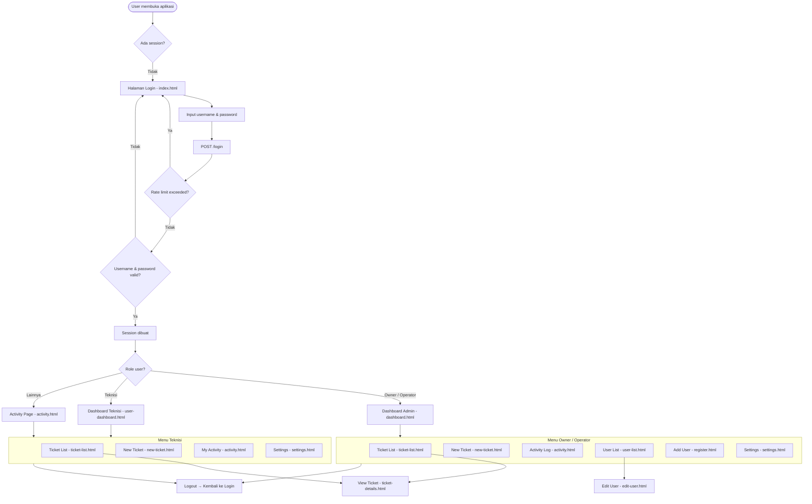

# 📋 Analisis Project: Ticketing & Activity Logging System

**Dokumen:** ANALISIS.md  
**Tanggal:** 2026-07-07  
**Generator:** Analisis otomatis dari codebase

---

## 📌 Daftar Isi

- [1. Identitas Aplikasi](#1-identitas-aplikasi)
- [2. Struktur Database](#2-struktur-database)
- [3. Arsitektur Aplikasi](#3-arsitektur-aplikasi)
- [4. Flowchart Aplikasi](#4-flowchart-aplikasi)
  - [4.1 Alur Utama (Level 1)](#41-alur-utama-level-1)
  - [4.2 Authentication Flow](#42-authentication-flow)
  - [4.3 Ticket CRUD Flow](#43-ticket-crud-flow)
  - [4.4 Dashboard Flow](#44-dashboard-flow)
  - [4.5 Activity Log Flow](#45-activity-log-flow)
  - [4.6 User Management Flow](#46-user-management-flow)
  - [4.7 Settings Flow](#47-settings-flow)
- [5. Daftar Fungsi Backend (API)](#5-daftar-fungsi-backend-api)
- [6. Daftar Halaman Frontend](#6-daftar-halaman-frontend)
- [7. Middleware](#7-middleware)
- [8. Keamanan](#8-keamanan)
- [9. Konfigurasi Environment](#9-konfigurasi-environment)
- [10. Catatan Teknis](#10-catatan-teknis)

---

## 1. Identitas Aplikasi

| Atribut | Detail |
|---|---|
| **Nama** | Login App — *Ticketing & Activity Logging System* |
| **Stack** | Node.js + Express.js + MySQL |
| **Frontend** | Vanilla HTML/CSS/JS + Chart.js + jsPDF |
| **Arsitektur** | Monolith (Backend API + Frontend served from same server) |
| **Status** | Production-ready |
| **Autentikasi** | Session-based dengan MySQL store |
| **Role System** | Owner, Operator, Teknisi |
| **PWA** | Service worker untuk caching offline |

---

## 2. Struktur Database

### 2.1 Table: `users` — Manajemen User

| Field | Type | Constraint | Keterangan |
|---|---|---|---|
| `id` | INT | PK, AUTO_INCREMENT | ID user |
| `username` | VARCHAR(255) | UNIQUE, NOT NULL | Login identifier |
| `password` | VARCHAR(255) | NOT NULL | bcrypt hash |
| `full_name` | VARCHAR(255) | NOT NULL | Nama lengkap |
| `role` | VARCHAR(50) | DEFAULT 'User' | `Owner`, `Operator`, atau `Teknisi` |
| `phone` | VARCHAR(20) | - | Nomor telepon |
| `photo` | VARCHAR(255) | - | Path foto profil |
| `created_at` | TIMESTAMP | DEFAULT CURRENT_TIMESTAMP | Waktu dibuat |
| `date_selesai` | TIMESTAMP | NULL | - |

### 2.2 Table: `tickets` — Tiket Pekerjaan/Laporan

| Field | Type | Constraint | Keterangan |
|---|---|---|---|
| `id` | INT | PK, AUTO_INCREMENT | ID tiket |
| `aktifitas` | VARCHAR(255) | NOT NULL | Nama aktivitas/jenis pekerjaan |
| `sub_node` | VARCHAR(50) | - | Sub-node jaringan |
| `odc` | VARCHAR(50) | - | Optical Distribution Cabinet |
| `lokasi` | VARCHAR(100) | - | Lokasi pekerjaan |
| `pic` | VARCHAR(255) | - | Person in Charge |
| `priority` | VARCHAR(50) | - | Prioritas |
| `status` | VARCHAR(50) | DEFAULT 'Terlapor' | `Terlapor`, `Dikerjakan`, `Pending`, `Selesai` |
| `info` | TEXT | - | Deskripsi/informasi tambahan |
| `evidence` | VARCHAR(255) | - | Path file bukti foto |
| `created_by` | VARCHAR(255) | - | Pembuat tiket |
| `created_at` | TIMESTAMP | DEFAULT CURRENT_TIMESTAMP | Waktu dibuat |
| `date_selesai` | TIMESTAMP | NULL | - |

### 2.3 Table: `activities` — Log Aktivitas

| Field | Type | Constraint | Keterangan |
|---|---|---|---|
| `id` | INT | PK, AUTO_INCREMENT | ID aktivitas |
| `description` | TEXT | NOT NULL | Deskripsi aktivitas |
| `username` | VARCHAR(255) | NOT NULL | Pelaku aktivitas |
| `date` | TIMESTAMP | DEFAULT CURRENT_TIMESTAMP | Waktu aktivitas |
| `created_at` | TIMESTAMP | DEFAULT CURRENT_TIMESTAMP | - |
| `date_selesai` | TIMESTAMP | NULL | - |

### 2.4 Table: `ticket_status_history` — Riwayat Perubahan Status Tiket

| Field | Type | Constraint | Keterangan |
|---|---|---|---|
| `id` | INT | PK, AUTO_INCREMENT | ID riwayat |
| `ticket_id` | INT | NOT NULL, FK → tickets(id) ON DELETE CASCADE | ID tiket terkait |
| `old_status` | VARCHAR(50) | - | Status sebelumnya |
| `new_status` | VARCHAR(50) | NOT NULL | Status baru |
| `changed_by` | VARCHAR(255) | NOT NULL, FK → users(username) ON DELETE CASCADE | Pengubah |
| `changed_at` | DATETIME | DEFAULT CURRENT_TIMESTAMP | Waktu perubahan |

### 2.5 Table: `settings` — Pengaturan Aplikasi

| Field | Type | Constraint | Keterangan |
|---|---|---|---|
| `setting_key` | VARCHAR(255) | PK | Key pengaturan |
| `setting_value` | TEXT | - | Value pengaturan |

**Data yang disimpan:**
- `company_name` — Nama perusahaan (ditampilkan di navbar)
- `company_logo` — URL logo perusahaan

---

## 3. Arsitektur Aplikasi

```
login-app/
│
├── server.js                    # Entry point — Express app, middleware setup, routes mount
├── db.js                        # Koneksi MySQL dengan connection pool (max 10)
├── .env                         # Konfigurasi environment
├── package.json                 # Dependencies & metadata
├── schema.sql                   # Database schema SQL
│
├── middleware/
│   ├── auth.js                  # isAuthenticated, isAdmin, isOwnerOrOperator
│   └── upload.js                # Multer config (storage, file filter, size limit)
│
├── routes/
│   ├── auth.js                  # POST /login, POST /logout, POST /register
│   ├── users.js                 # GET/POST/DELETE users, update profile
│   ├── tickets.js               # CRUD tickets + status history
│   ├── activities.js            # CRUD activity logs
│   └── settings.js              # Company name & logo settings
│
├── utils/
│   └── logger.js                # Winston logger (daily rotate, error & app logs)
│
├── public/
│   ├── *.html                   # 10 halaman frontend
│   ├── js/*.js                  # 12 file JavaScript frontend
│   ├── css/style.css            # Styling aplikasi
│   ├── uploads/                 # Folder penyimpanan file upload
│   └── vendor/                  # Font Awesome CSS
│
├── scripts/
│   └── migrate_history.js       # Migration untuk ticket_status_history
│
├── docs/
│   ├── code_documentation_id.md # Dokumentasi Bahasa Indonesia
│   └── code_documentation_en.md # Dokumentasi Bahasa Inggris
│
└── logs/                        # Log file (app-*.log, error-*.log)
```

### Dependency Tree

```
server.js
 ├── dotenv           → Load .env
 ├── express          → Web framework
 ├── helmet           → Security headers
 ├── express-rate-limit → Rate limiting
 ├── express-session  → Session management
 ├── express-mysql-session → MySQL session store
 ├── multer           → File upload handling
 ├── winston          → Logging
 ├── path / fs        → Node.js built-in
 │
 ├── middleware/auth.js
 ├── middleware/upload.js
 ├── utils/logger.js
 │
 ├── routes/auth.js   → bcryptjs, express-validator
 ├── routes/users.js  → bcryptjs
 ├── routes/tickets.js → express-validator
 ├── routes/activities.js → express-validator
 └── routes/settings.js
```

---

## 4. Flowchart Aplikasi

### 4.1 Alur Utama (Level 1)



### 4.2 Authentication Flow

```
┌─────────────────────────────────────────────────────────────────┐
│                    AUTHENTICATION FLOW                           │
├─────────────────────────────────────────────────────────────────┤
│                                                                  │
│  ┌──────────┐    ┌──────────────┐    ┌──────────────────────┐  │
│  │ Login    │───▶│ Rate Limit   │───▶│ Validasi Input       │  │
│  │ Page     │    │ 5 req/15min │    │ express-validator    │  │
│  └──────────┘    └──────────────┘    └──────────────────────┘  │
│                                                  │              │
│                                                  ▼              │
│                                        ┌──────────────────┐    │
│                                        │ Query DB by      │    │
│                                        │ username          │    │
│                                        └──────────────────┘    │
│                                                  │              │
│                                                  ▼              │
│                               ┌────────┐    ┌──────────┐       │
│                               │ User   │◀───│ bcrypt   │       │
│                               │ found? │    │ compare  │       │
│                               └────────┘    └──────────┘       │
│                              │         │                        │
│                             Tidak      Ya                       │
│                              │         │                        │
│                              ▼         ▼                        │
│                       ┌──────────┐  ┌────────────────────┐     │
│                       │ 401      │  │ Set session.user   │     │
│                       │ Invalid  │  │ mapUser()          │     │
│                       └──────────┘  └────────────────────┘     │
│                                              │                  │
│                                              ▼                  │
│                                     ┌──────────────────────┐   │
│                                     │ Redirect by Role:    │   │
│                                     │ Owner/Operator →     │   │
│                                     │   dashboard.html     │   │
│                                     │ Teknisi →           │   │
│                                     │   activity.html     │   │
│                                     └──────────────────────┘   │
│                                                                  │
│  ┌──────────┐    ┌────────────────────┐                         │
│  │ Logout   │───▶│ Session destroyed  │                         │
│  │ Button   │    │ Cookie cleared     │                         │
│  └──────────┘    └────────────────────┘                         │
│                                                                  │
│  ┌──────────┐    ┌──────────────────┐    ┌─────────────────┐    │
│  │ Register │───▶│ isAuthenticated  │───▶│ isAdmin          │   │
│  │ Form     │    │ + registerLimiter│    │ (Owner only)     │   │
│  └──────────┘    └──────────────────┘    └─────────────────┘   │
│                         │                              │        │
│                         ▼                              ▼        │
│                 ┌────────────────┐            ┌─────────────┐   │
│                 │ bcrypt hash(10)│            │ 401/403     │   │
│                 │ INSERT to DB   │            │ Error       │   │
│                 │ Role whitelist │            └─────────────┘   │
│                 └────────────────┘                              │
│                                                                  │
└─────────────────────────────────────────────────────────────────┘
```

### 4.3 Ticket CRUD Flow

```
┌────────────────────────────────────────────────────────────────────────────────────┐
│                              TICKET CRUD FLOW                                      │
├────────────────────────────────────────────────────────────────────────────────────┤
│                                                                                     │
│  ┌────────────────────────────────────────────────────────────────────────────┐    │
│  │ CREATE                                                                      │    │
│  │                                                                             │    │
│  │  [New Ticket Form]                                                          │    │
│  │   - Aktifitas (required)                                                    │    │
│  │   - Sub-Node, ODC, Lokasi, PIC, Priority, Info                              │    │
│  │   - Evidence (file upload: gambar, max 5MB)                                 │    │
│  │         │                                                                   │    │
│  │         ▼                                                                   │    │
│  │  Multer upload → POST /tickets                                              │    │
│  │         │                                                                   │    │
│  │         ▼                                                                   │    │
│  │  Validasi: express-validator                                                │    │
│  │         │                                                                   │    │
│  │         ▼                                                                   │    │
│  │  IDOR Check: createdBy === session.username                                 │    │
│  │         │                                                                   │    │
│  │         ▼                                                                   │    │
│  │  INSERT INTO tickets                                                        │    │
│  │  Default status: 'Terlapor'                                                 │    │
│  │         │                                                                   │    │
│  │         ▼                                                                   │    │
│  │  Redirect ke ticket-list.html                                               │    │
│  └────────────────────────────────────────────────────────────────────────────┘    │
│                                                                                     │
│  ┌────────────────────────────────────────────────────────────────────────────┐    │
│  │ READ                                                                        │    │
│  │                                                                             │    │
│  │  [Ticket List Page]                                                         │    │
│  │   - GET /tickets → SELECT * ORDER BY created_at DESC                       │    │
│  │   - Render table dengan pagination (10 items/page)                         │    │
│  │   - Filter: search (global), status, priority, date range                  │    │
│  │   - Sort: click header (id, aktifitas, status, priority, createdAt)        │    │
│  │   - Export: CSV (BOM for Excel) & PDF (jsPDF + autoTable)                  │    │
│  │                                                                             │    │
│  │  [Ticket Detail Page]                                                       │    │
│  │   - GET /tickets/:id                                                        │    │
│  │   - IDOR Check: creator === session.user ATAU role Admin?                  │    │
│  │   - Tampilkan: semua field + evidence image + button edit & delete         │    │
│  │   - GET /tickets/:id/history → timeline status changes                     │    │
│  └────────────────────────────────────────────────────────────────────────────┘    │
│                                                                                     │
│  ┌────────────────────────────────────────────────────────────────────────────┐    │
│  │ UPDATE                                                                      │    │
│  │                                                                             │    │
│  │  [Edit Modal]                                                               │    │
│  │   - Populate form dari currentTicket                                        │    │
│  │   - Edit: aktifitas, subNode, odc, lokasi, pic, priority, status, info     │    │
│  │   - Evidence: upload baru                                                   │    │
│  │         │                                                                   │    │
│  │         ▼                                                                   │    │
│  │  POST /tickets/:id/update                                                   │    │
│  │         │                                                                   │    │
│  │         ▼                                                                   │    │
│  │  IDOR Check                                                                 │    │
│  │         │                                                                   │    │
│  │         ▼                                                                   │    │
│  │  Dynamic UPDATE (hanya field yang diisi)                                    │    │
│  │         │                                                                   │    │
│  │         ▼                                                                   │    │
│  │  Jika status berubah → INSERT ticket_status_history                         │    │
│  │                                                                             │    │
│  │  [Delete]                                                                   │    │
│  │   - Confirm dialog → DELETE /tickets/:id                                   │    │
│  │   - IDOR Check → DELETE from DB                                            │    │
│  └────────────────────────────────────────────────────────────────────────────┘    │
│                                                                                     │
└────────────────────────────────────────────────────────────────────────────────────┘
```

### 4.4 Dashboard Flow

```
┌────────────────────────────────────────────────────────────────────┐
│                        DASHBOARD FLOW                              │
├────────────────────────────────────────────────────────────────────┤
│                                                                    │
│  [Dashboard Loads]                                                 │
│       │                                                           │
│       ├──▶ GET /tickets                                            │
│       │       │                                                   │
│       │       ├──▶ updateStats()                                   │
│       │       │       ├── totalDone    = filter status 'Selesai'   │
│       │       │       ├── totalOnProgress = filter 'Dikerjakan'   │
│       │       │       ├── totalPending = filter 'Pending'/'Terlapor'│
│       │       │       ├── totalTickets = all                       │
│       │       │       ├── newThisWeek  = created >= 7 days ago    │
│       │       │       └── completionRate = (done/total) * 100     │
│       │       │                                                   │
│       │       ├──▶ renderChart(groupBy)                            │
│       │       │       ├── Group by: subNode / odc / aktifitas     │
│       │       │       ├── Chart type: Bar / Pie (toggle)          │
│       │       │       ├── Summary text: "Most in [category]"      │
│       │       │       └── Download as PNG                         │
│       │       │                                                   │
│       │       └──▶ renderRecentTickets()                           │
│       │               ├── Filter non-'Selesai'                    │
│       │               ├── Sort by created_at DESC                 │
│       │               ├── Top 10 items                            │
│       │               └── Search filter (id, aktifitas, subNode)  │
│       │                                                           │
│       ├──▶ GET /activities                                         │
│       │       └──▶ renderActivityLog()                             │
│       │               ├── Filter by Teknisi (dropdown)            │
│       │               └── Top 10 activities                       │
│       │                                                           │
│       └──▶ GET /users                                              │
│               └── Filter Teknisi untuk dropdown filter aktivitas  │
│                                                                    │
└────────────────────────────────────────────────────────────────────┘
```

### 4.5 Activity Log Flow

```
┌────────────────────────────────────────────────────────────────────┐
│                       ACTIVITY LOG FLOW                            │
├────────────────────────────────────────────────────────────────────┤
│                                                                    │
│  [Activity Page Loads]                                             │
│       │                                                           │
│       ├──▶ GET /activities                                         │
│       │     Role Owner/Operator → semua aktivitas + delete button │
│       │     Role Teknisi        → aktivitas sendiri               │
│       │                                                           │
│       └──▶ GET /tickets                                            │
│             Filter status 'Terlapor' untuk dropdown ticket select  │
│                                                                    │
│  [Log New Activity]                                                │
│   - Pilih ticket dari dropdown                                    │
│   - Isi deskripsi aktivitas                                       │
│   - Submit → POST /activities                                     │
│         │                                                        │
│         ▼                                                        │
│   IDOR Check: username === session.username                       │
│         │                                                        │
│         ▼                                                        │
│   INSERT INTO activities                                          │
│         │                                                        │
│         ▼                                                        │
│   Refresh list                                                    │
│                                                                    │
│  [Export]                                                         │
│   - CSV: Date, Ticket Description, Activity Description           │
│   - PDF: jsPDF + autoTable                                        │
│                                                                    │
│  [Delete Activity - Owner/Operator only]                          │
│   - Click trash icon                                              │
│   - Confirm dialog                                                │
│   - DELETE /activities/:id                                        │
│         │                                                        │
│         ▼                                                        │
│   Role check → DELETE from DB                                     │
│                                                                    │
└────────────────────────────────────────────────────────────────────┘
```

### 4.6 User Management Flow

```
┌────────────────────────────────────────────────────────────────────┐
│                      USER MANAGEMENT FLOW                          │
├────────────────────────────────────────────────────────────────────┤
│                                                                    │
│  [User List - Owner/Operator only]                                 │
│       │                                                           │
│       └──▶ GET /users → render table                              │
│               │                                                   │
│               ├── [Edit - Owner only]                              │
│               │   Click Edit → edit-user.html?username=X          │
│               │   Form: fullName, phone, role, password           │
│               │   Submit → POST /admin/users/update               │
│               │                                                   │
│               ├── [Delete - Owner only]                            │
│               │   Click Delete → confirm → DELETE /users/:username │
│               │                                                   │
│               └── [Update Role - Owner only]                       │
│                   POST /update-role (username, newRole)            │
│                                                                    │
│  [Add User - Owner only]                                           │
│   register.html → POST /register (wajib auth + role Owner)        │
│   - Setelah sukses: form reset (tetap di halaman)                 │
│   - Owner bisa create multiple users tanpa logout                 │
│                                                                    │
│  [Update Profile - All roles]                                      │
│   settings.html → POST /update-profile                             │
│   - Update: password, phone, photo                                 │
│   - Validasi: currentPassword harus benar                         │
│                                                                    │
└────────────────────────────────────────────────────────────────────┘
```

### 4.7 Settings Flow

```
┌────────────────────────────────────────────────────────────────────┐
│                         SETTINGS FLOW                              │
├────────────────────────────────────────────────────────────────────┤
│                                                                    │
│  [Settings Page Load]                                              │
│       │                                                           │
│       ├──▶ Load user dari localStorage                            │
│       │       ├── settingsUsername = user.username                │
│       │       ├── settingsFullName = user.fullName                │
│       │       └── settingsPhone   = user.phone                    │
│       │                                                           │
│       └──▶ Jika role = Owner                                       │
│               ├── Tampilkan Company Name field                    │
│               │   └── GET /settings/company-name                  │
│               └── Tampilkan Company Logo upload                   │
│                                                                    │
│  [Submit Settings]                                                 │
│       │                                                           │
│       ├── 1. POST /update-profile (FormData)                      │
│       │       - username, currentPassword, newPassword, phone     │
│       │       - photo (file)                                      │
│       │                                                           │
│       ├── 2. Jika role = Owner                                     │
│       │       ├── POST /settings/company-name { companyName }     │
│       │       └── POST /settings/company-logo (FormData: logo)    │
│       │                                                           │
│       └── 3. Update localStorage → reload page untuk refresh navbar│
│                                                                    │
└────────────────────────────────────────────────────────────────────┘
```

---

## 5. Daftar Fungsi Backend (API)

### 5.1 Auth Routes — [routes/auth.js](../routes/auth.js)

| Method | Endpoint | Middleware | Auth | Fungsi |
|---|---|---|---|---|
| `POST` | `/login` | `loginLimiter` (5x/15min), `body().trim().escape()` | Public | Login user, set session, redirect based on role |
| `POST` | `/logout` | - | Authenticated | Destroy session, clear cookie |
| `POST` | `/register` | `isAuthenticated`, `isAdmin`, `registerLimiter` (5x/jam), `upload.single('photo')`, validasi length + role whitelist | Owner only | Register user baru oleh Owner. Role tervalidasi whitelist. |

**Helper:**
| Fungsi | Deskripsi |
|---|---|
| `mapUser(user)` | Mapping `full_name` → `fullName`, `created_at` → `createdAt` untuk frontend |

### 5.2 User Routes — [routes/users.js](../routes/users.js)

| Method | Endpoint | Middleware | Role | Fungsi |
|---|---|---|---|---|
| `POST` | `/update-profile` | `isAuthenticated`, `upload.single('photo')` | All | Update profile sendiri (password, phone, photo) |
| `GET` | `/users` | `isAuthenticated`, `isOwnerOrOperator` | Owner, Operator | Ambil semua users |
| `GET` | `/users/:username` | `isAuthenticated` | Self + Owner/Operator | Detail satu user |
| `POST` | `/update-role` | `isAuthenticated`, `isAdmin` | Owner only | Ubah role user |
| `DELETE` | `/users/:username` | `isAuthenticated`, `isAdmin` | Owner only | Hapus user |
| `POST` | `/admin/users/update` | `isAuthenticated`, `isAdmin` | Owner only | Admin update user (fullname, password, phone, role) |

### 5.3 Ticket Routes — [routes/tickets.js](../routes/tickets.js)

| Method | Endpoint | Middleware | Role | Fungsi |
|---|---|---|---|---|
| `POST` | `/tickets` | `isAuthenticated`, `upload.single('evidence')`, validasi | All | Buat tiket baru (default status: 'Terlapor') |
| `GET` | `/tickets` | `isAuthenticated` | All | Ambil semua tiket (ORDER BY created_at DESC) |
| `GET` | `/tickets/:id` | `isAuthenticated` | Owner/Creator | Detail tiket dengan IDOR check |
| `POST` | `/tickets/:id/update` | `isAuthenticated`, `upload.single('evidence')` | Owner/Creator | Update field tiket + log history jika status berubah |
| `GET` | `/tickets/:id/history` | `isAuthenticated` | Owner/Creator | Riwayat status tiket (JOIN users) |
| `DELETE` | `/tickets/:id` | `isAuthenticated` | Owner/Creator | Hapus tiket |

### 5.4 Activity Routes — [routes/activities.js](../routes/activities.js)

| Method | Endpoint | Middleware | Role | Fungsi |
|---|---|---|---|---|
| `POST` | `/activities` | `isAuthenticated`, validasi | All | Log aktivitas baru terkait tiket |
| `GET` | `/activities` | `isAuthenticated` | Owner/Operator: all; Teknisi: self | Ambil aktivitas (JOIN tickets) |
| `DELETE` | `/activities/:id` | `isAuthenticated` | Owner/Operator only | Hapus aktivitas |

### 5.5 Settings Routes — [routes/settings.js](../routes/settings.js)

| Method | Endpoint | Middleware | Role | Fungsi |
|---|---|---|---|---|
| `GET` | `/settings/company-name` | - | Public | Ambil nama perusahaan |
| `POST` | `/settings/company-name` | `isAuthenticated`, `isAdmin` | Owner only | Update nama perusahaan |
| `GET` | `/settings/company-logo` | - | Public | Ambil URL logo perusahaan |
| `POST` | `/settings/company-logo` | `isAuthenticated`, `isAdmin`, `upload.single('logo')` | Owner only | Upload logo perusahaan |

---

## 6. Daftar Halaman Frontend

### 6.1 Halaman & File JS

| # | Halaman (.html) | File JS | Route | Fungsi Utama |
|---|---|---|---|---|
| 1 | [index.html](../public/index.html) | [script.js](../public/js/script.js) | `/` | Login page — form submit ke `/login`, handle error modal, redirect |
| 2 | [dashboard.html](../public/dashboard.html) | [dashboard.js](../public/js/dashboard.js) | `/dashboard.html` | **Admin Dashboard**: stats cards, chart (bar/pie), recent tickets, search, activity log, filter by Teknisi |
| 3 | [user-dashboard.html](../public/user-dashboard.html) | [user-dashboard.js](../public/js/user-dashboard.js) | `/user-dashboard.html` | **User Dashboard**: recent tickets & activity milik user sendiri |
| 4 | [ticket-list.html](../public/ticket-list.html) | [ticket-list.js](../public/js/ticket-list.js) | `/ticket-list.html` | Ticket table: pagination, filter (search, status, priority, date), sort (click header), export CSV/PDF |
| 5 | [ticket-details.html](../public/ticket-details.html) | [ticket-details.js](../public/js/ticket-details.js) | `/ticket-details.html?id=N` | Detail tiket: info, evidence image, edit modal, delete, timeline history |
| 6 | [new-ticket.html](../public/new-ticket.html) | [new-ticket.js](../public/js/new-ticket.js) | `/new-ticket.html` | Form create tiket: load users untuk PIC dropdown, FormData upload |
| 7 | [activity.html](../public/activity.html) | [activity.js](../public/js/activity.js) | `/activity.html` | Activity log: form log aktivitas, list dengan delete (Owner/Operator), export CSV/PDF |
| 8 | [register.html](../public/register.html) | [register.js](../public/js/register.js) | `/register.html` | Register: **hanya Owner**. Redirect ke dashboard jika bukan Owner. Form reset setelah sukses untuk create multiple users. |
| 9 | [user-list.html](../public/user-list.html) | [user-list.js](../public/js/user-list.js) | `/user-list.html` | User table: photo, name, username, role, edit/delete buttons (Owner only), toast notifications |
| 10 | [edit-user.html](../public/edit-user.html) | [edit-user.js](../public/js/edit-user.js) | `/edit-user.html?username=X` | Edit user form (Owner only): fullName, phone, role, password |
| 11 | [settings.html](../public/settings.html) | [settings.js](../public/js/settings.js) | `/settings.html` | Settings: update profile (password, phone, photo) + company name & logo (Owner only) |

### 6.2 Komponen Global

| Komponen | File | Fungsi |
|---|---|---|
| **Navbar/Sidebar** | [navbar.js](../public/js/navbar.js) | Sidebar collapsible dengan localStorage persistence, company branding (nama + logo dari API), user profile dropdown, logout, PWA service worker registration, mobile responsive toggle |
| **Service Worker** | [sw.js](../public/sw.js) | Cache static assets untuk offline, network-first untuk API calls, stale-while-revalidate untuk assets |
| **CSS** | [css/style.css](../public/css/style.css) | Styling aplikasi dengan CSS variables |

### 6.3 Fitur Global Frontend

- ✅ **PWA Support**: Service worker cache semua HTML/JS/CSS untuk akses offline
- ✅ **Fetch Interceptor**: Dashboard.js override `window.fetch` → redirect ke login jika 401
- ✅ **Sidebar Collapsible**: State tersimpan di localStorage
- ✅ **Role-based Navigation**: Menu berbeda untuk Owner/Operator vs Teknisi
- ✅ **Company Branding**: Nama & logo dari database ditampilkan di navbar

---

## 7. Middleware

### 7.1 Auth Middleware — [middleware/auth.js](../middleware/auth.js)

| Fungsi | Logic | Status Code | Pesan |
|---|---|---|---|
| `isAuthenticated` | `req.session && req.session.user` | `401` | `Unauthorized: Please log in` |
| `isAdmin` | `req.session.user.role === 'Owner'` | `403` | `Forbidden: Owner access required` |
| `isOwnerOrOperator` | `role === 'Owner' \|\| role === 'Operator'` | `403` | `Forbidden: Owner or Operator access required` |

### 7.2 Upload Middleware — [middleware/upload.js](../middleware/upload.js)

| Konfigurasi | Value |
|---|---|
| **Storage** | Disk → `public/uploads/` |
| **Filename** | `Date.now() + '-' + cleanName` (sanitized: `[^a-zA-Z0-9.]` → `_`) |
| **File Filter** | Hanya gambar: `jpeg, jpg, png, gif, webp` |
| **Max Size** | 5 MB |

### 7.3 Global Middleware (di server.js)

| Middleware | Konfigurasi |
|---|---|
| `express.json()` | Parse JSON body |
| `express.urlencoded({ extended: true })` | Parse form data |
| `express.static('public')` | Serve static files |
| `helmet()` | Security headers dengan CSP custom |
| Request Logger | Winston info log setiap request (`${method} ${url}`) |
| `rateLimit()` | Global: 1000 request per 15 menit per IP |
| `session()` | MySQL session store, 24 jam expiry, httpOnly, sameSite strict |

### 7.4 Global Error Handler (server.js)

| Error Type | Response |
|---|---|
| `multer.MulterError` | `400` — Upload error message |
| Custom file type error | `400` — Only image files allowed |
| Unhandled errors | `500` — Internal Server Error |

---

## 8. Keamanan

| Lapisan | Implementasi | Detail |
|---|---|---|
| **Security Headers** | `helmet` | Content Security Policy: script dari 'self' + cdn.jsdelivr.net, style dari 'self' + fonts.googleapis.com, font dari fonts.gstatic.com, img dari 'self' + data: + via.placeholder.com |
| **Rate Limiting** | `express-rate-limit` | Global: 1000 req/15 menit; Login: 5 req/15 menit; Register: 5 req/jam |
| **Password Hashing** | `bcryptjs` | 10 salt rounds |
| **Input Validation** | `express-validator` | trim, escape, notEmpty, isLength |
| **Session Auth** | `express-session` + MySQL store | Cookie: httpOnly, sameSite strict, 24 jam expiry |
| **IDOR Protection** | Manual check | Setiap akses tiket dicek: `creator === session.user ATAU role Admin` |
| **RBAC** | Middleware | `isAdmin` (Owner), `isOwnerOrOperator` (Owner/Operator) |
| **File Upload** | Multer filter | Hanya gambar (jpeg,jpg,png,gif,webp), max 5MB, filename sanitized |
| **CSRF Protection** | SameSite cookie | `sameSite: 'strict'` |

### Role Access Matrix

| Fitur | Owner | Operator | Teknisi |
|---|---|---|---|
| Dashboard Admin | ✅ | ✅ | ❌ |
| Dashboard User | ✅ | ✅ | ✅ |
| View All Tickets | ✅ | ✅ | ✅ |
| View Own Tickets | ✅ | ✅ | ✅ |
| Create Ticket | ✅ | ✅ | ✅ |
| Edit Any Ticket | ✅ | ✅ | ✅ |
| Edit Own Ticket | ✅ | ✅ | ✅ |
| Delete Any Ticket | ✅ | ✅ | ❌ |
| View All Users | ✅ | ✅ | ❌ |
| Edit Users | ✅ | ❌ | ❌ |
| Delete Users | ✅ | ❌ | ❌ |
| Change User Role | ✅ | ❌ | ❌ |
| View All Activities | ✅ | ✅ | ❌ (self only) |
| Delete Activities | ✅ | ✅ | ❌ |
| Update Company Settings | ✅ | ❌ | ❌ |
| Register Users | ✅ | ❌ | ❌ |

---

## 9. Konfigurasi Environment

File: `.env`

```env
DB_HOST=localhost
DB_USER=login_app_user
DB_PASSWORD=strongpassword
DB_NAME=login_app_db
PORT=3000
SESSION_SECRET=supersecretkey123
```

### Dependencies (package.json)

| Package | Versi | Fungsi |
|---|---|---|
| `express` | ^5.1.0 | Web framework |
| `mysql2` | ^3.15.3 | Database driver (Promise-based) |
| `bcryptjs` | ^3.0.3 | Password hashing |
| `express-session` | ^1.18.2 | Session management |
| `express-mysql-session` | ^3.0.3 | MySQL session store |
| `express-rate-limit` | ^8.2.1 | Rate limiting |
| `express-validator` | ^7.3.1 | Input validation |
| `helmet` | ^8.1.0 | Security headers |
| `multer` | ^2.0.2 | File upload handling |
| `winston` | ^3.19.0 | Logging |
| `winston-daily-rotate-file` | ^5.0.0 | Log rotation |
| `dotenv` | ^17.2.3 | Environment variables |
| `axios` | ^1.13.2 | HTTP client |
| `axios-cookiejar-support` | ^6.0.5 | Cookie jar for axios |
| `tough-cookie` | ^6.0.0 | Cookie management |
| `@fortawesome/fontawesome-free` | ^7.1.0 | Icons |

---

## 10. Catatan Teknis

### 10.1 Arsitektur & Desain

- **Monolith**: Backend (Express API) dan Frontend (static HTML/JS) dalam satu server
- **Database-first**: Semua logika bisnis di backend dengan query SQL langsung (tanpa ORM)
- **Session-based auth**: Tidak menggunakan JWT, session disimpan di MySQL via `express-mysql-session`
- **Vanilla JS frontend**: Tidak ada framework frontend (React/Vue), menggunakan vanilla JavaScript

### 10.2 Pola yang Digunakan

- **Connection Pool**: MySQL connection pool dengan max 10 koneksi
- **Helper Function**: `mapUser()`, `mapTicket()` untuk transformasi data DB → format frontend
- **Middleware Pattern**: Auth middleware berantai untuk RBAC
- **Dynamic UPDATE query**: Hanya field yang diisi yang diupdate (tickets, users)
- **IDOR Protection**: Manual ownership check di setiap endpoint kritis

### 10.3 File Upload Workflow

```
User pilih file → Multer filter (gambar only, max 5MB)
    → Simpan ke public/uploads/
    → Simpan path (contoh: /uploads/1712345678-photo.jpg) ke DB
    → Frontend render dari path tersebut
```

### 10.4 Logging Workflow

```
Setiap request → Log info ke console (dev) + app-*.log
Error → Log error ke error-*.log
Log rotation → Weekly (YYYY-WW pattern), max 20MB/file, retain 14 days
```

### 10.5 PWA & Caching Strategy

- **Cache Name**: `login-app-v2`
- **Install**: Cache semua HTML, JS, CSS, Font Awesome
- **Activate**: Hapus cache lama (versi sebelumnya)
- **Fetch Strategy**:
  - API calls (`/api/` atau non-GET): Network First (fallback ke cache)
  - Static assets: Stale-While-Revalidate (cache dulu, update di background)

### 10.6 Catatan Penting

1. **Role di middleware isAdmin** hanya untuk `Owner`, bukan `Admin` — meskipun ada pengecekan `role === 'Admin'` di route activities
2. **Tidak ada npm start script** di package.json — hanya ada `"test": "echo \\"Error: no test specified\\" && exit 1"`
3. **CSP helmet** mengizinkan `unsafe-inline` untuk script dan style
4. **Cookie tidak secure** (`secure: false`) — perlu diaktifkan jika menggunakan HTTPS
5. **Database memiliki field legacy** (`date_selesai` di tickets, activities) yang tidak digunakan di logika aplikasi. `date_selesai` sudah tidak ada di tabel `users` sejak schema.sql diselaraskan dengan real database
6. **Pagination sudah di backend** — GET /tickets dan GET /activities support `?page=N&limit=N`. Frontend ticket-list.js menggunakan server-side pagination. Dashboard tetap backward compatible (ambil semua tanpa page param)
7. **Register sudah diamankan** — Sekarang wajib `isAuthenticated` + `isAdmin` (hanya Owner). Ditambah `registerLimiter` (5x/jam) dan validasi role whitelist
8. **Login error message** — Sudah disederhanakan menjadi `'Invalid credentials'` untuk mencegah username enumeration

---

*Dokumen ini dibuat berdasarkan analisis menyeluruh terhadap codebase pada 2026-07-07.*
